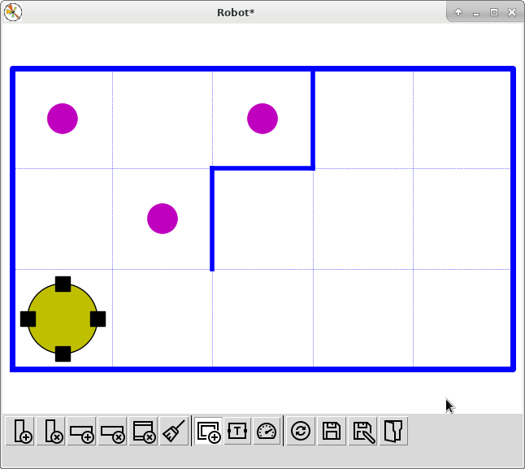

# Robot

Robot on the plaid field

[Описание на русском](README.ru.md)

# Table of Content

* [Requirements](#requirements)
* [Installation](#installation)
* [Robot](#class-robot)
    * [Robot methods](#robot-methods)
* [RobotOrt](#robotort)
    * [RobotOrt methods](#robotort-methods)
* [RobotRot](#robotrot)
    * [RobotRot methods](#robotrot-methods)
* [Basic usage](#basic-usage)
* [Usage with python command line](#usage-with-python-command-line)
* [Working with the interface](#working-with-the-interface)
    * [Control buttons](#control-buttons)
    * [Keyboard control](#keyboard-control)    
* [Bug](#bug)

# Requirements

- Python 3.6.x
- tkinter (include in the standard Python distribution)
- numpy
- matplotlib


# Installation
You should use command line terminal.

First variant. Clone repo and go to the package dir

```commandline
git clone https://github.com/Sherevv/robot.git robot

cd robot
```

and execute command:
```
python setup.py install
```
or
```
pip install .
```

Second variant. Remote using pip:

```
pip install git+https://github.com/Sherevv/robot.git
```


# Class Robot

    r = Robot()
    r = Robot( mapfile )
    r = Robot( delay=0.5 ) or r = Robot(None, 0.5 )                

In the 1st case, the standard dialog box opens for
in case of failure, the file selection dialog opens for
definition of field options

In the 2nd case:
- `mapfile` - the name of the file where the field map is stored

In the 3rd case:
- `delay` - the time delay during animation (defaults to `0.5` seconds)

## Robot methods

**step(side)** - moves robot on one step to the set `side`

**mark()** - puts a marker in the current cell

**is_mark()** - check if marker exists in the current cell

**is_bord(side)** - check if border exists in the set side

**get_tmpr()** - returns value of temperature in the current cell

`side` can use values `'n'`, `'s'`, `'w'`, `'o'` respectively North, South, West, East

# RobotOrt

The RobotOrt class, each object of this class represents an executor of a "oriented robot on a cellular field"
The direction of travel, turns and check for obstacles are set on: 
- step forward; 
- turn left; 
- turn right;
- check if there is an wall right on the course.

## RobotOrt methods

**forward()** - move the robot forward to the next cell 

**right()** - turn the robot to the right

**left()** - turn the robot to the left

**is_bord()** - check if there is an wall right on the course.

**get_side()** - get the current direction of the robot

Methods **mark()**, **is_mark()**, **get_tmpr()** - correspond to the `Robot` class methods

# RobotRot

It differs from the `RobotOrt` class in that instead of two methods `left`  and
`right` the `RobotOrt` class has only one method `rot`, but with a parameter,
 which can have 3 values: `'left'`, `'right'`, `'back'` (or `'l'`, `'r'`,`'b'`)
and also because the `is_bord` method has a parameter that can
    accept also 3 values: `'forward'`, `'left'`, `'right'`


## RobotRot methods

**rot(side)** - turn the robot left, right or back

**is_bord(side)** - check if border exists in the side

The other methods are the same as in the `RobotOrt` class.

# Basic usage

Create script, example start.py
```python
from robot import Robot, RobotOrt, RobotRot

r = Robot()             # Robot create
if not r.is_mark():     # Check if current cell is marked
    r.mark()            # Mark cell
if not r.is_bord('w'):  # Check if border exists in West side
    r.step('w')         # Move to West
print(r.get_tmpr())     # Print temperature in current cell


ro = RobotOrt()         # Create orient robot
if not ro.is_bord():    # Check if border exists in front of robot
    ro.forward()        # Move forward
ro.right()              # Turn robot right
if not ro.is_bord():    # Check if border exists in front of robot
    ro.forward()        # Move forward
print(ro.get_side())    # Print robot orientation


rt = RobotRot()                # Create orient robot
if not rt.is_bord('forward'):  # Check if border exists in front of robot
    rt.forward()               # Move forward
if not rt.is_bord('right'):    # Check if border exists to the right of robot
    rt.rot('r')                # Turn robot right
    rt.forward()               # Move forward
print(rt.get_side())           # Print robot orientation


input()  # to prevent close plot window
```

then execute script
```commandline
python start.py
```


# Usage with python command line

Prepare script with function (myfunc.py):
```python
def walk_to_bord(r, side):
    """
    The robot goes until it meets the wall in the specified direction

    :param r:    robot object
    :param side: move side
    """
    while not r.is_bord(side):
        r.step(side)
```

then run python command line
```commandline
python
```


```
>>> from robot import Robot
>>> from myfunc import walk_to_bord
>>> r = Robot()
>>> walk_to_bord(r, 'o')
```

[Code examples](robot/examples)


# Working with the interface

When creating a robot instance, a window with a field and a robot appears:


Change ( install or edit ) the initial situation on the field, you can use the mouse:
- click on a cell to set a marker
- click on the marker to delete the marker
- click on the dotted grid line of the checkered field sets partition
- clicking on the partition removes the partition
- click on the robot and move the mouse when the key is left
         moves the robot after the cursor to the desired cell
         (a" faulty "robot can also be "repaired" this way )
         
After any number of such actions you should save field state, after that the robot is ready for the command
management

## Keyboard control

The window has buttons to control the field and its state, they can be controlled from the keyboard.

 - add one column to the field (key `w`)

 - remove one column from the field (key `e`)

 - add one row to the field (key `h`)

 - remove one row from the field (key `j`)

 - removes all borders (`ctrl + b`)

 - remove all markers (`ctrl + m`)

 - add/delete the outer frame of the field (key `b`)

 - show/hide the temperature of the cell (key `t`)

 - enable/disable time delay and animation effects (key `d`)

 - restore state of the field from file (key `r`)

 - save state of the field to file (without save dialog)(key `s`)

 - save state of the field to file (`ctrl + s`)

 -  load state of the field from file (`ctrl + l`)

## Control buttons

The main keys to control the field are listed above.

In addition, the following combinations work:

`ctrl + '+'` -  increases the time delay by 2 times

`ctrl + '-'` - reduces the time delay by half

`ctrl + r`  - moves the robot to the lower left corner

# Bug

There is a class for the "bug in the maze" problem (original problem [here](http://buglab.ru)). Initially, the bug is in the upper left corner, the output is in the lower right cell. The bug moves independently in search of an exit by a certain algorithm. It is necessary to build a maze in which the bug will wander as long as possible. There must be a way to the exit, and the field must have an outer frame.

Usage:
```python
from robot.bug import Bug

b = Bug('bug.map', delay=0.0001)  # or just Bug()
b.go()  # start bug walking


input() # to prevent close plot window
```